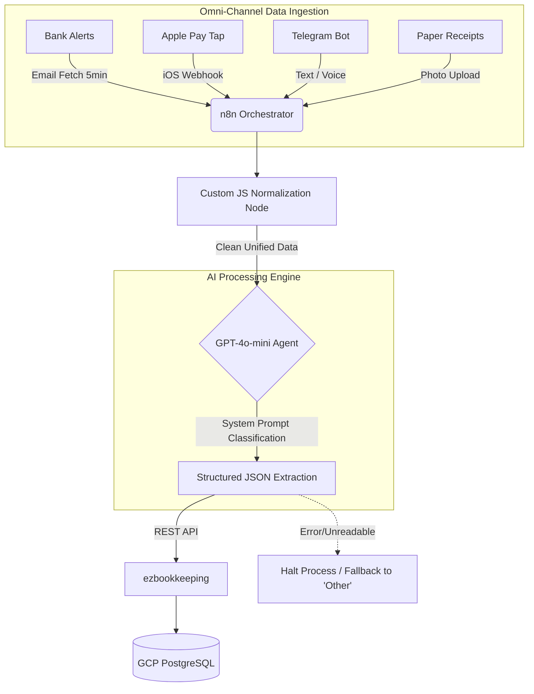

# 🤖 AI-Powered Financial Data Pipeline

> An end-to-end automated bookkeeping workflow using n8n, GCP, and OpenAI to eliminate manual data entry via omni-channel data ingestion.

   

## 🚀 Why I Built This (The Impact)

Manual budget tracking is inherently error-prone and time-consuming. Traditional automation relies on brittle Regex rules that fail when transaction descriptions or bank email formats change. I engineered this intelligent pipeline to:

- **Eradicate 100% of manual data entry** for financial tracking across multiple banks and payment methods.
- **Categorize real-time transactions automatically** with zero human intervention by leveraging AI semantic understanding.
- **Save dozens of hours monthly**, ensuring flawless financial reporting and immediate cash flow visibility.

## 🧠 System Architecture

## ✨ Key Features & Technical Depth

- **Omni-Channel Ingestion**: Engineered robust ingestion points to capture every edge case of spending:
  - **Email Parsing**: n8n polling mechanism (every 5 mins) to catch multi-bank transaction alerts.
  - **Apple Pay / NFC**: Integrated iOS Shortcuts to trigger secure webhooks instantly upon tap.
  - **Telegram Bot**: Supports manual edge-cases via text input or voice message transcription.
  - **Receipt OCR**: Resolves the "cash payment" problem by passing photo uploads directly to AI vision models.
- **Cross-Bank Normalization (JavaScript)**: Developed custom JavaScript nodes within n8n to strip diverse HTML/text formats from different banks, outputting a unified data schema before it hits the LLM. This saves token cost and improves accuracy.
- **Prompt Engineering & Context Control**: Mitigated LLM hallucination by injecting strict system prompts containing a custom dictionary of categories and definitions. The model maps unstructured text strictly to predefined schemas rather than guessing.
- **Fault Tolerance & Fallback Logic**: 
  - If the transaction context is completely unrecognizable or missing key data, the pipeline halts to prevent database pollution (dirty data).
  - If recognizable but ambiguous, the pipeline defaults to an "Other" category for seamless manual review.

## 🔄 Additional Workflow: Credit Card Auto-Reconciliation

Alongside daily transaction parsing, I engineered a secondary n8n workflow designed to monitor and automatically log monthly credit card statement repayments.
- Autonomously detects payment triggers and records the transfer between checking accounts and credit lines within `ezbookkeeping`.
- Maintains a **flawless, zero-balance financial ledger** without any manual reconciliation at the end of the month.

## 🛠️ Tech Stack

- **Orchestration**: n8n
- **Cloud Infrastructure**: Google Cloud Platform (GCP) Virtual Private Server (VPS)
- **Database**: PostgreSQL
- **AI / Logic**: OpenAI GPT-4o-mini, Prompt Engineering
- **Application**: ezbookkeeping (Self-hosted via Docker)
- **Integrations**: iOS Shortcuts (Webhooks), Telegram API

 

---
*Developed by [Weilin Cheng](https://www.linkedin.com/in/weilin-cheng/) | [Portfolio](https://wlc.gd.edu.kg/)*
